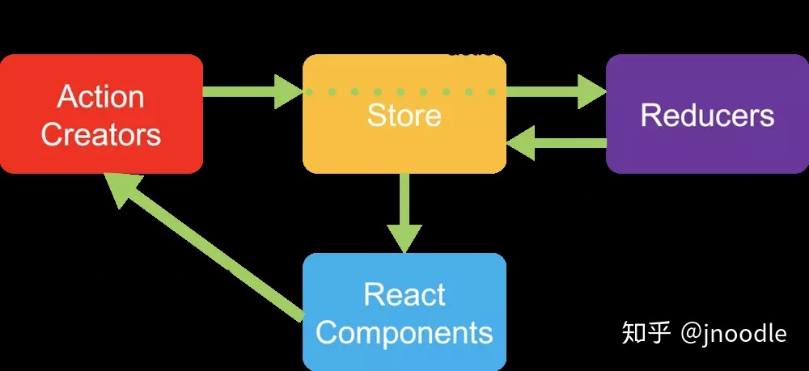
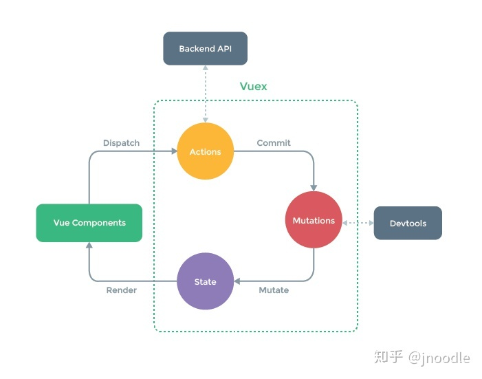

> 把组件之间需要共享的状态抽取出来，遵循特定的约定，统一管理，让状态的变化可以预测

store flux redux vuex redux-saga dva mobx
### store模式
最简单的是把状态存到一个外部变量里面，
```
const store = {
    state: {
        message: 'store',
    },
    setMessageAction(newVal){
        this.state.message = newVal
    },
    clearMessageAction(newVal){
        this.state.message = ''
    }
}
```
- store里的state用来存储数据
- store里面有一堆action，用来改变state，不直接对state进行改变，而是通过action
- 通过action，可以知道改变(mutation)是怎样触发的

如果没有限制组件里面不能修改store中的state，如果组件进行修改，没有通过action，那么无法追踪改变是如何发生的，所以规定必须通过action改变state

组件里通过action来分发(dispatch)事件通知store去改变state

### Redux

1. 用户通过view分发action
```
store.dispatch(action)
```
2. store自动调用Reducer，传入两个参数：当前state，和收到的action，reducer会返回新的state
```
const nextState = reducer(previousState, action)
```
3. 若state发生变化，store调用监听函数
```
store.subscribe(listener)
```
4. listener通过store.getState()得到当前状态，如果使用的是react，可以触发重新渲染view
```
function listener(){
    const nextState = store.getState()
    component.setState(nextState)
}
```
#### store
redux里只有一个store，store中的state不能直接修改，每次只能返回一个新的state
store允许使用store.subscribe方法设置监听函数，一旦state发生变化，就自动执行这个函数，这样只要把view的更新函数subscribe一下，一旦state发生变化，view就自动渲染，react中，render和setState就订阅就行

#### action
action就是view发春的通知，通知store state需要改变，action必须要有type属性，代表action的名字
```
const action = {
    type: 'ADD_TODO',
    payload: ''
}
```

#### reducer
纯函数，store收到action后，给出一个新的state，这个计算过程就是reducer
```
(prevState, action) => newState
```
redux: 单一数据源；state只读；使用纯函数执行修改
redux中：
- 同步：action发出之后，reducer立刻计算state
- 异步：action发出之后，隔一段事件再执行reducer

### vuex

#### store
每一个vuex有一个全局的store
```
const app = new Vue({
    el: '#app',
    store,
    components: {Header},
    templates: `<div>{{num}}</div>`
})
const Header = {
    templates: `<h1>header</h1>`,
    comouted: {
        num(){
            return this.$store.count
        }
    }
}
```

#### mutation
vuex中修改state的方式叫做mutation，更改vuex的store中的状态的唯一方法是提交mutation，每个mutation都有一个字符串的时间类型(type)和一个回调函数(handler)
```
const store = new Vuex.Store({
    state: {
        count: 1
    },
    mutations: {
        increment(state){
            // 变更状态
            state.count ++
        }
    }
})
```
触发mutation事件的方式不是直接调用，需要通过store.commit()方法
```
store.commit('increment')
```
*mutation是同步事务*
 mutation类似于redux的reducer，但是不要求每次返回一个新的state可以直接修改state

Redux: view -> actions -> reducer -> state变化 -> view变化
Vuex: view -> commit -> mutations -> state变化 -> view变化 
      view -> dispatch -> actions -> mutations -> view变化

#### dva
```
app.model({
  // namespace - 对应 reducer 在 combine 到 rootReducer 时的 key 值
  namespace: 'products',
  // state - 对应 reducer 的 initialState
  state: {
    list: [],
    loading: false,
  },
  // subscription - 在 dom ready 后执行
  subscriptions: [
    function(dispatch) {
      dispatch({type: 'products/query'});
    },
  ],
  // effects - 对应 saga，并简化了使用
  effects: {
    ['products/query']: function*() {
      yield call(delay(800));
      yield put({
        type: 'products/query/success',
        payload: ['ant-tool', 'roof'],
      });
    },
  },
  // reducers - 就是传统的 reducers
  reducers: {
    ['products/query'](state) {
      return { ...state, loading: true, };
    },
    ['products/query/success'](state, { payload }) {
      return { ...state, loading: false, list: payload };
    },
  },
});
```
#### redux-saga
#### mobx
